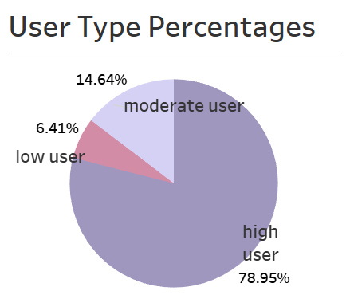
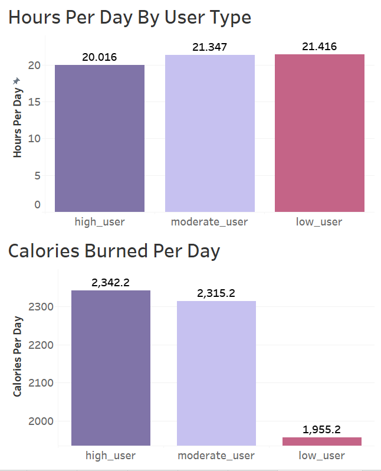
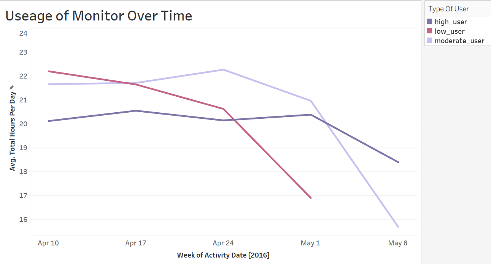
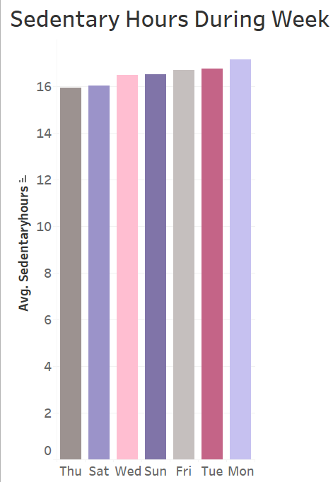
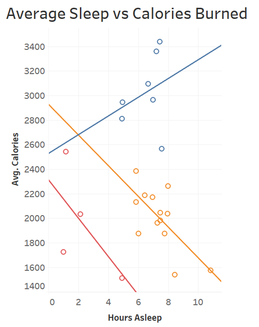
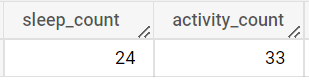

# Bellabeat-Casestudy

## Introduction
This case study was the culminating project for the Google Data Analytics Professional Certificate course I completed with Coursera. 
 
## Company Information
Founded in 2013, Bellabeat is a company that specializes in the manufacter of high-tech devices geared toward women's health and wellness. Bellabeat produces wellness trackers, including wearable trackers such as Leaf(can be worn as a bracelet, necklace, or clip) and Time(watch), and a "smart" waterbottle called Spring. They are headquarted in San Fransisco, and have additional offices in London and Zagreb. 

## Key Business Task
The task is to analyze non-Bellabeat smart device usage to gain insight into customer behavior, analyze trends and make recommendations for Bellabeat marketing strategy.

## Data Source and Considerations
The data source used is public [FitBit fitness tracker data](https://www.kaggle.com/datasets/arashnic/fitbit) (CC0: Public Domain). This dataset was downloaded from Kaggle where it was made available by Möbius. This data set contains the information from 33 participants who used a FitBit to track minute-to-minute data on physical activity, heartrate and sleep monitoring. The data was collected during the time period of 3/12/2016-5/12/2016.
Data limitations:
  * small sample size (33 participants)
  * short time period (31 days - *though the description indicates a 2 month period, data shows only the time period of 4/12/2016-5/12/2016*)
  * no demographic data
  * outdated data (collected in 2016)

## Data Processing
From the entire data set I used the following tables:
* dailyActivity_merged.csv
* sleepDay_merged.csv
Other tables included information that were either redundant (found in the dailyActivity table), or had too few entries to be considered significant.

Upon download of the files, the following steps were taken to clean the data:
* distinct Ids were counted
* date data was sorted and filtered (showing the 31 day time window, as previously mentioned)
* duplicate entries were deleted (3 found in dailyActivity_merged.csv)
* "LoggedActivitiesDistance" was deleted, as it contained mostly zeros
* minutes data was converted into hours, for readability
* a "DayOfWeek" column was formed from date data
* date data was transformed to MM/DD/YYYY
* formatted all decimal data to 2 decimals

## Data Analysis
After cleaning data in Google Sheets, I used SQL Big Query and Tableau to organize and visualize trends in the data.

First I gathered some general user data:
```TSQL
SELECT
 Id,
 ROUND (AVG(TotalSteps),2) avg_steps,
 ROUND (AVG(TotalHours),2) avg_hours
FROM `coursera-project-358501.fitbit_data.activity`
GROUP BY Id
```

I then grouped users into categories, based on logged activity:
```TSQL
SELECT
 Id,
 COUNT(Id) as logged_activity,
 CASE 
  WHEN COUNT(Id) >= 30 THEN 'high_user'
  WHEN COUNT(Id) BETWEEN 26 AND 29 THEN 'moderate_user'
  WHEN COUNT(Id) < 25 THEN 'low_user'
END AS type_of_user
FROM `coursera-project-358501.fitbit_data.activity`
GROUP BY Id
ORDER BY logged_activity DESC
```



The majority of FitBit wearers during this study were "high users", meaning that they wore the device at some point at least 30 out of the 31 day period.

With categories in place, I pulled data for steps, hours, and calories.
```TSQL 
SELECT
 Id,
 COUNT(Id) as logged_activity,
 ROUND (AVG(TotalSteps),2) avg_steps,
 ROUND (AVG(TotalHours),2) avg_hours,
 ROUND(AVG(VeryActiveHours),2) avg_active_hours,
 ROUND(AVG(FairlyActiveHours),2) avg_fairly_active_hours,
 ROUND(AVG(LightlyActiveHours),2) avg_lgithly_active_hours,
 ROUND(AVG(SedentaryHours),2) avg_sedentary_hours,
 AVG(calories) as avg_calories,
 CASE 
  WHEN COUNT(Id) >= 30 THEN 'high_user'
  WHEN COUNT(Id) BETWEEN 26 AND 29 THEN 'moderate_user'
  WHEN COUNT(Id) < 25 THEN 'low_user'
END AS type_of_user
FROM `coursera-project-358501.fitbit_data.activity`
GROUP BY Id
ORDER BY logged_activity DESC
```


Low users (users who wore the device less than 25 out of the 31 day period) tend to burn the least calories, despite wearing the device for the longest amount of time per day.


For all participants, usage decreased dramatically over the 31 day time period.

Here I wanted to investigate the link between the day of the week and sedentary vs. active hours recorded.
```TSQL
SELECT dayofweek, SedentaryHours 
FROM `coursera-project-358501.fitbit_data.activity`
```

On average the participants were the most sedentary on Mondays and Tuesdays, with Thursdays being the least.

Here I looked for a correlation between sleep recorded and activity (here in the form of calories burned in a day)

Though there do appear to be clusters of users, there does not appear to be a strong correlation between the time a user sleeps and the amount of calories they burn in a day.

Next I looked at the comparison between daytime and nighttime use:
```TSQL
SELECT COUNT (distinct s.id) sleep_count, COUNT(distinct a.id) activity_count
FROM `coursera-project-358501.fitbit_data.sleep` s
  RIGHT JOIN `coursera-project-358501.fitbit_data.activity` a on a.id = s.id
```

 
 
 27% percent of users did not use the device even once to track sleep over the course of the trial.

 ## Recommendations
 1. There is a large discrepancy between overall use and nighttime(sleep) usage. The [CDC recommends](https://www.cdc.gov/sleep/about_sleep/how_much_sleep.html) a minimum of 7 hours of sleep for adults, and 8-10 hours for teenagers. My recommendation is for Bellabeat to design a comfortable product geared specifically for nighttime use.
 2. There does seem to be a correlation between regular use and calories burned. Bellabeat can focus on health campaigns geared toward healthy lifestyle, with emphasis on this correlation. However, more data is needed for this endeavor.
 3. This study shows that the average user is the most sedentary on Mondays and Tuesdays. The device giving reminders specifically on these days that encourage activity would also encourage device usage.
 4. All users wore the device less as the study went on. The device itself could encourage streaks, or a campaign incentivising continued use should be implemented.
 In general, while the data do highlight some trends that Bellabeat could make marketing decisions based on, more data points need to be collected, more current data needs to be collected, and demographics need to be included for the results to be considered conclusive.
